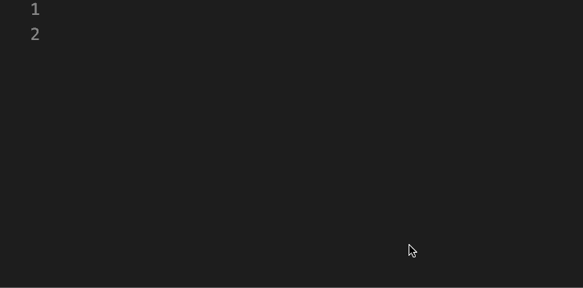
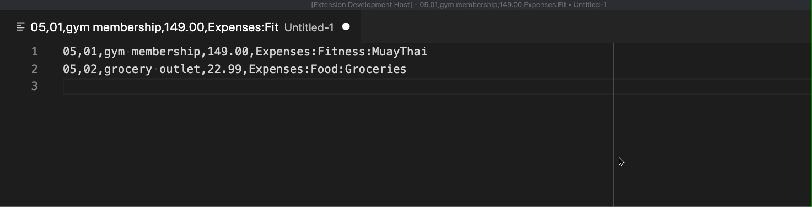

# Beanquick

A quick way to manually enter Beancount transactions in Visual Studio Code.

```
05,01,gym membership,149.00,Expenses:Fitness:MuayThai
05,02,grocery outlet,22.99,Expenses:Food:Groceries
```
becomes
```
2020-05-01 * "gym membership"
    Expenses:Fitness:MuayThai 149.00 USD
    Assets:Checking

2020-05-02 * "grocery outlet"
    Expenses:Food:Groceries 22.99 USD
    Assets:Checking
```

Beanquick is useful if you manually enter groups of transactions:
- belonging to the same year
- debiting the same account

## Installation

Beanquick isn't polished enough for me to put it on the VS Code marketplace. Grab
the latest `vsix` release from this Github repo and run:
```
code --install-extension <vsix-file>
```

## Usage

After installing, set `beanquick.mainBeanFile` to the path of your `main.bean` file.
Beanquick needs this to suggest expense account names.

Open up a new editor and change the language from plain text to "Beanquick".  
Pressing `j` will populate a placeholder row. You can cycle forward through fields
with `Tab` and backwards with `Shift + Tab`:



Once you've got some transactions entered, bring up the command palette (`Shift + Command + P` on mac)
and select "Format to Beancount". Enter an account to be debited and a year.



Copy & paste your transactions into your Beancount file.
